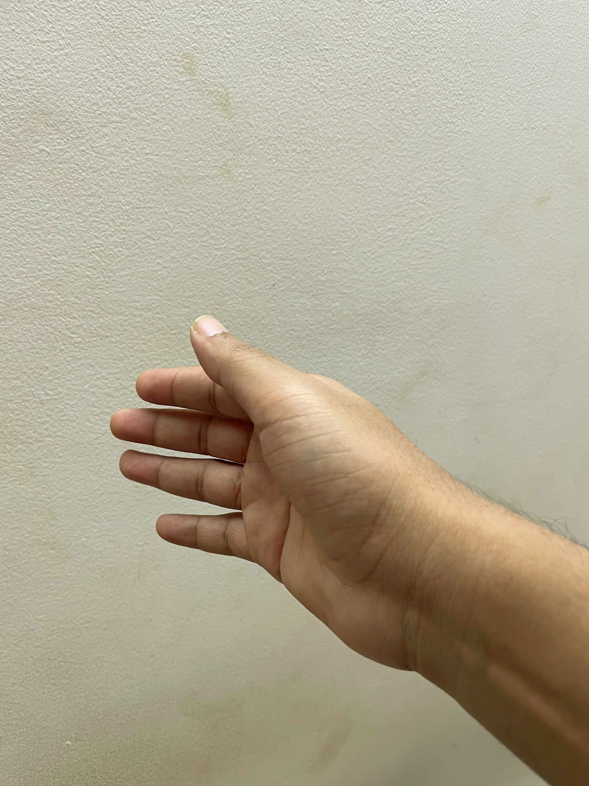
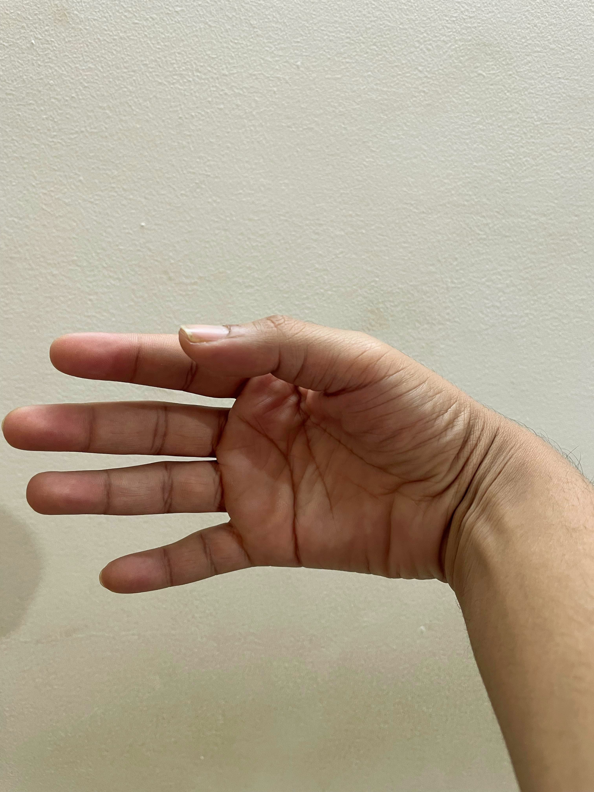
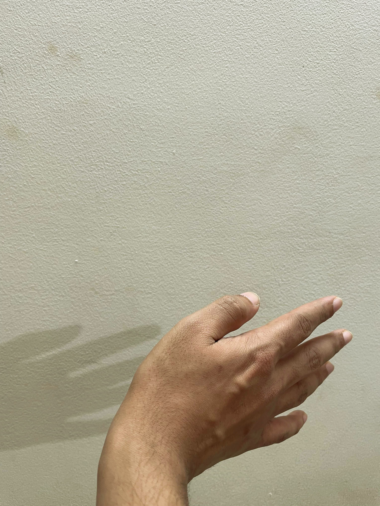
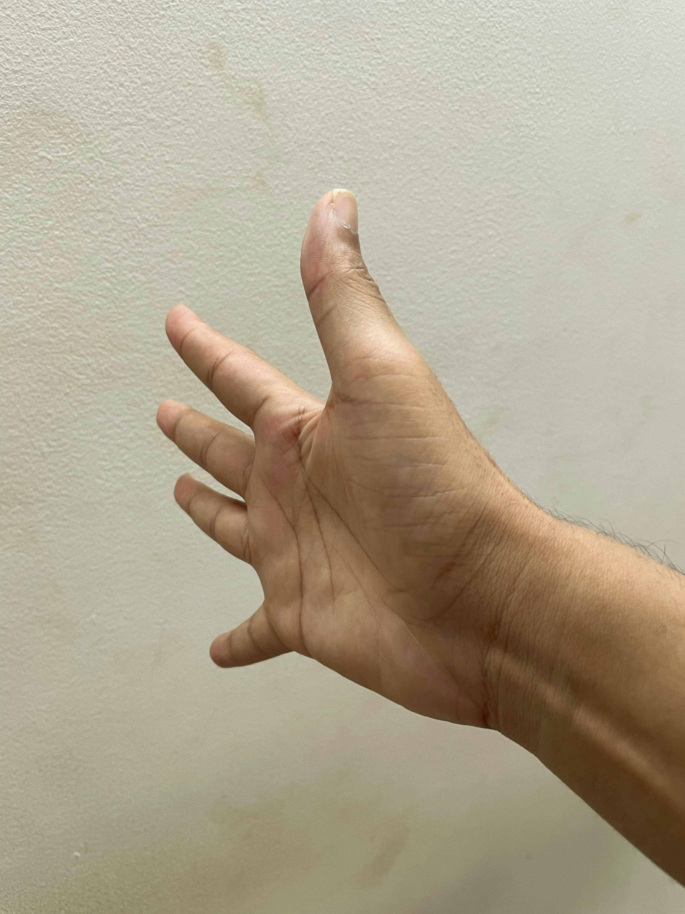
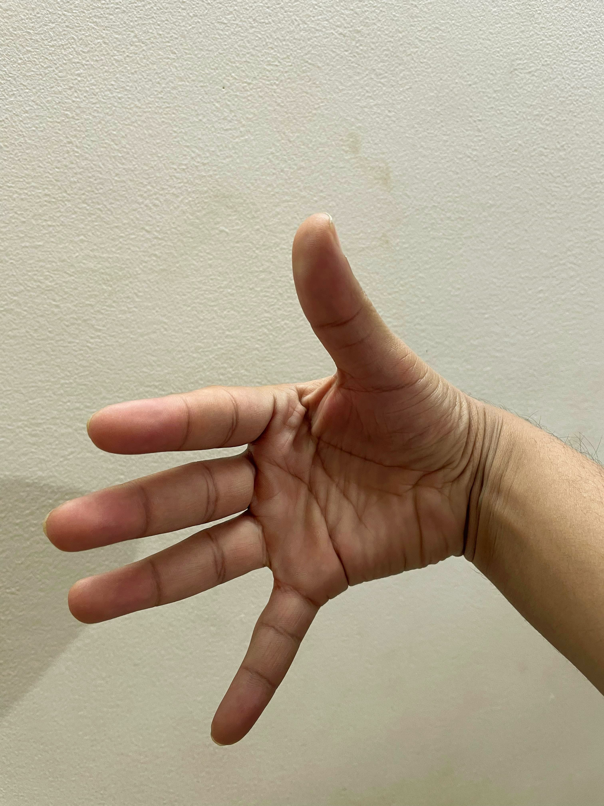
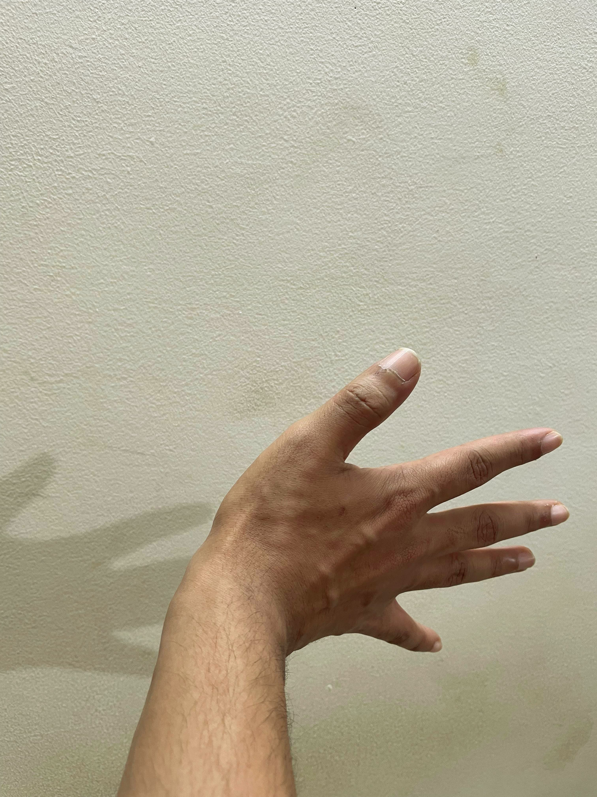

# EMG-Based Game Controller

This project transforms your muscle activity into keyboard keystrokes, enabling gesture-based control for gaming or other applications. By combining Arduino and Python, you can create a custom, gesture-controlled setup. Follow this guide to set up, test, and customize your EMG-based game controller.

## Gesture Mapping with Photos

| Gesture Description                  | Triggered Action            | Example Photo                          |
|--------------------------------------|-----------------------------|----------------------------------------|
| No muscle activity detected          | No keystroke                | |
| Bend hand to the left                | Left Arrow Key              |     |
| Bend hand to the right               | Right Arrow Key             |   |
| Flex fingers                         | Up Arrow Key                |  |
| Flex fingers + Bend hand to the left | Left + Up Arrow Keys        |     |
| Flex fingers + Bend hand to the right| Right + Up Arrow Keys       |   |

---

## Table of Contents
1. [Setup](#setup)
2. [Uploading the Code](#uploading-the-code)
3. [Testing & Playing](#testing--playing)
4. [Customizing Keystrokes](#customizing-keystrokes)
5. [Tips for Best Results](#tips-for-best-results)

---

## Setup

Before you begin, ensure you have the following:
- **Hardware**: Arduino board, EMG sensor, connecting cables, and electrodes.
- **Software**: 
  - [Arduino IDE](https://www.arduino.cc/en/software)
  - [Python](https://www.python.org/downloads)
  - Necessary Python modules (detailed in the Python script or README in the repository).

**Step 1: Stack Muscle BioAmp Shield on Arduino Uno**


**Step 2: Configure BioAmp EXG Pill for EMG/ECG (Optional)**

BioAmp EXG Pill is by default configured for recording EEG or EOG but if you want to record good quality ECG or EMG, then it is recommended to configure it by making a solder joint as shown in the image.

Note: Even without making the solder joint the BioAmp EXG Pill is capable of recording ECG or EMG but the signals would be more accurate if you configure it.

**Step 3: Connecting BioAmp EXG Pill**

Connect the BioAmp EXG Pill to the A2 port of Muscle BioAmp Shield via 3-pin STEMMA cable which has JST PH 2.0mm connector on one end and 3 female jumpers on the other end.

**Step 4: Connecting Electrode Cables**

Connect one BioAmp cable to BioAmp EXG Pill and another BioAmp cable to Muscle BioAmp Shield by inserting the cable ends into the respective JST PH connectors as shown above.
---

## Uploading the Code

1. **Connect Your Arduino**:
   - Use a USB cable to connect the Arduino to your laptop.

2. **Download the Code**:
   - Visit the [GitHub repository](#) and download the provided files.
   - Open the `12_2CH_EMG_Game_Controller.ino` file in Arduino IDE.

3. **Configure Arduino IDE**:
   - Select the correct **COM port** and **board** under the **Tools** menu.
   - If you’re unsure about these settings, refer to the quick guide in the repository.

4. **Upload the Code**:
   - Click the **Upload** button. A progress bar will indicate the upload status.

5. **Optimize Signal Quality**:
   - Sit at least 5 meters away from AC appliances or electronic devices to avoid interference.
   - Unplug your laptop charger to reduce electrical noise.

---

## Testing & Playing

1. **Test with the Serial Monitor**:
   - Open the Serial Monitor in Arduino IDE.
   - Set the baud rate to **115200**.
   - Observe real-time outputs:
     - `0`: No muscle activity detected, no keystroke triggered.
     - `1`: Bend your hand to the left, triggering the **Left Arrow** key.
     - `2`: Bend your hand to the right, triggering the **Right Arrow** key.
     - `3`: Flex your fingers, triggering the **Up Arrow** key.
     - `4`: Flex your fingers while bending your hand to the left, triggering the **Left Arrow** key and **Up Arrow** key.
     - `5`: Flex your fingers while bending your hand to the right, triggering the **Right Arrow** key and **Up Arrow** key.

2. **Run the Python Script**:
   - Open the `12_2CH_EMG_Game_Controller.py` script in [Visual Studio Code](https://code.visualstudio.com/) or any Python IDE.
   - Ensure all required Python modules are installed (commands available in the repository README).
   - Run the script. It will automatically detect your Arduino's COM port.
   - If the port isn’t detected, manually edit the COM port in the script:
     ```python
     ser = serial.Serial("COM_PORT_HERE", 115200)
     ```

3. **Observe Keystroke Mapping**:
   - The terminal will display mapped keystrokes based on your gestures.

---

## Customizing Keystrokes

1. Open the `12_2CH_EMG_Game_Controller.py` script in a text editor.
2. Locate lines like:
   ```python
   keyboard.press('left')
   ```
3. Replace `'left'`, `'right'`, or `'up'` with your desired keys. For example:
   - Replace `'left'` with `'A'` for racing games.
   - Replace `'right'` with `'D'` for movement in RPGs.

4. Save your changes and rerun the script.

---

## Tips for Best Results

- **Positioning**: Ensure the EMG sensors are securely attached to your muscles.
- **Avoid Interference**: Keep a distance from electronics or AC devices.
- **Adjust Settings**: Modify thresholds or keystroke timings in the code to suit your muscle activity and gameplay.

---

This Game Controller transforms your muscle movements into gaming actions, enhancing both accessibility and interactivity. Customize it for various games and enjoy your new EMG-based game controller!
